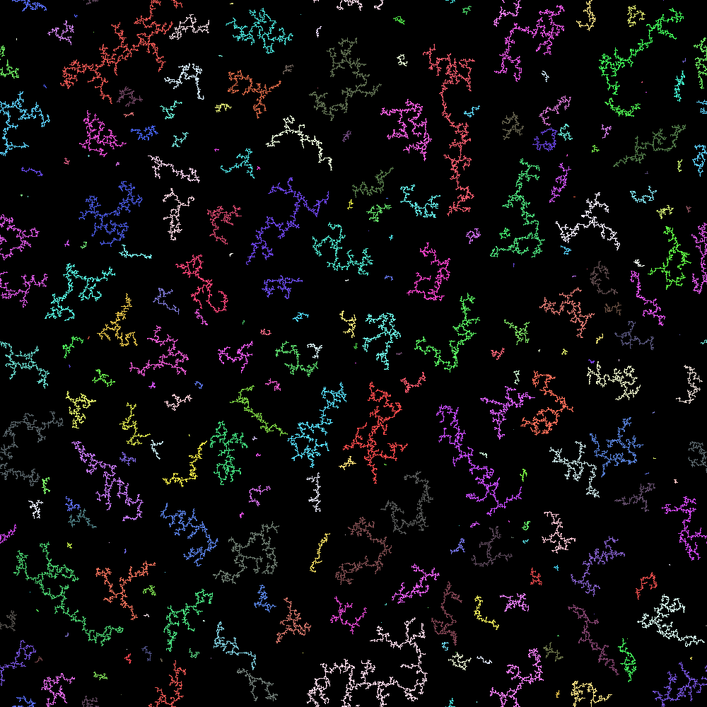
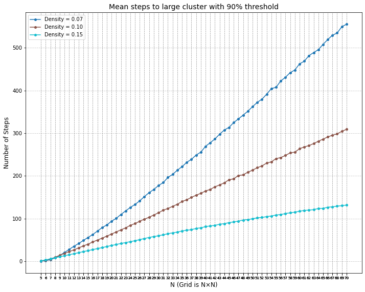

Aggregation
===========

This is a toy statistical mechanics simulation of atoms randomly aggregating into large molecules. Initially, the grid
is populated with matter at random positions (each grid cell contains matter with probability 'density' as specified by
the user). If two adjacent cells contain matter, they are clumped together into a single cluster. Then, at every time
step, each cluster moves in one of four cardinal directions picked at random. As soon as two cluster touch, they merge
into one. The simulation ends once some pre-specified proportion (the 'threshold') of total matter belongs to a single
cluster.

Screenshot
----------

Here is a snapshot of a 1000x1000 simulation in progress.

Results
-------

This plot shows the number of time steps required to achieve a large cluster containing at least 90% of the total mass,
as a function of lattice size, with 10% initial matter density. Each data point is a mean of 10,000 simulation trials.

Running
-------

On Linux, run `make` to build. To build on other platforms, refer to the
[fenster readme](https://github.com/zserge/fenster).

Then, run:

    $  aggregation <width> <height> <density> <threshold> <trials>

        width, height: Size of grid, e.g., 100 by 100
        density: Initial proportion of cells with matter, e.g., 0.1. Must be between 0 and 1.
        threshold: The target mass proportion for the largest cluster, e.g., 0.9. Must be
            between 0 and 1.
        trials: The number of simulation runs to perform. If this is 1, then the simulation
            will be displayed visually; if it is greater than 1, statistics will be printed
            to the console only.
